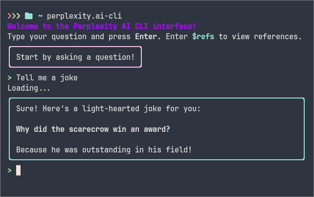

# Perplexity AI Command Line Interface (CLI)

The Perplexity AI command line interface (CLI) allows users to interact with Perplexity AI directly from their terminal.

## Installation

To install the CLI, simply run the following command in your terminal:

```bash
python install.py
```

To uninstall the application, run:

```bash
python uninstall.py
```

To run the application, simply type:

```bash
perplexity.ai-cli.py
```

## Usage Instructions

- **Exiting the CLI**: Use **Ctrl-C** to quit the application.
- **Getting References**: To retrieve references for your queries, type `$refs`.

## screenshot



## Credits

- [Helpingai](https://github.com/HelpingAI/Helpingai_T2)
- [redscorpse](https://github.com/redscorpse/perplexity.ai-cli)
